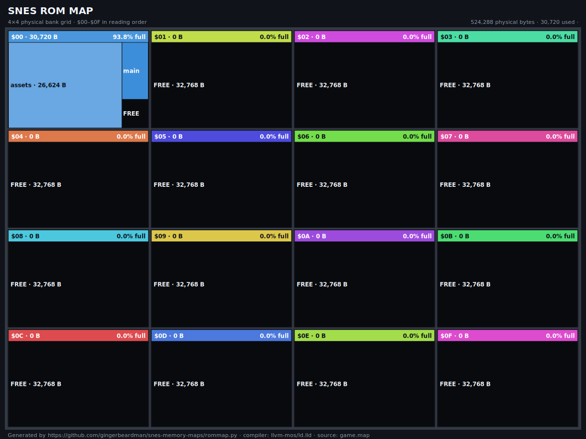
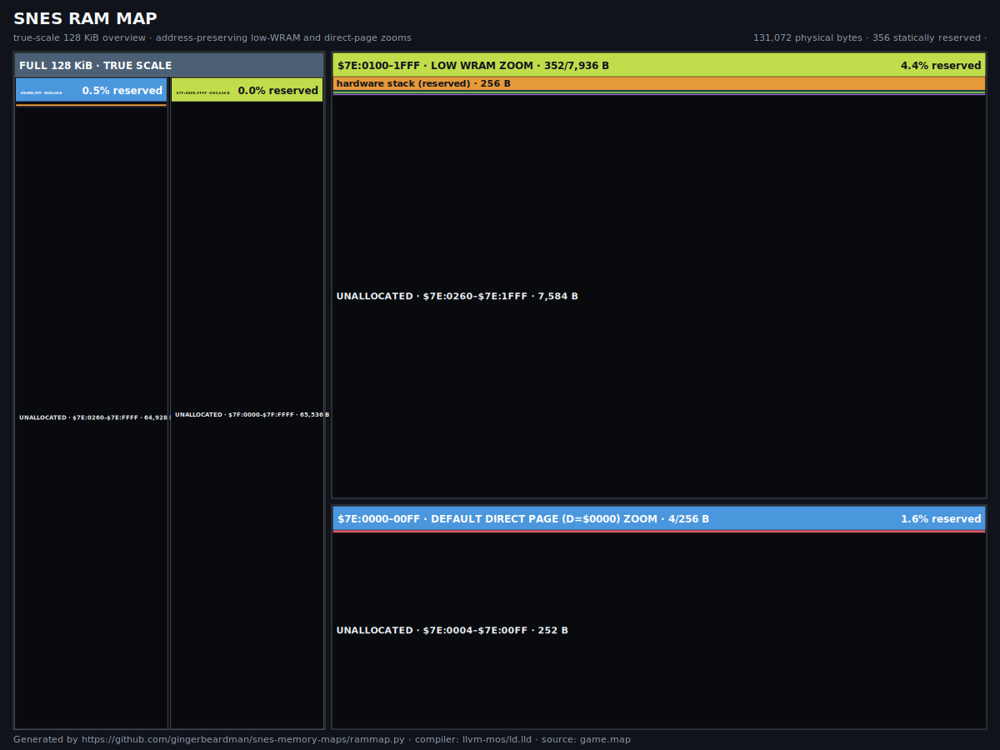

# SNES Memory Maps

Generate zoomable SVG maps of SNES ROM and WRAM from linker map files, with
optional machine-readable CSV output.

Supports both the [llvm-mos](https://github.com/llvm-mos/llvm-mos) (ld.lld) and
[vbcc65816](http://www.compilers.de/vbcc.html) (vlink) toolchains; the map
format is auto-detected.

The repository provides two command-line scripts:

- `rommap.py` creates a physical-bank ROM treemap.
- `rammap.py` creates an address-preserving WRAM overview with low-WRAM and
  direct-page zooms.

Both are thin entry points to `snesmap.py`, the shared engine that does the map
parsing, layout, and rendering; they simply preset ROM or RAM mode. Keeping one
engine means the ~95% of logic the two maps share lives in a single place, while
you still get the two commands you'd expect. (`snesmap.py` is not meant to be run
directly.)

All three use only the Python 3 standard library. Their SVG output supports
light and dark colour schemes, browser zooming, and per-allocation tooltips.

## Examples

### ROM



### RAM



## Quick start

Run the scripts from the directory containing your linker script:

```sh
python3 /path/to/rommap.py build/game.map \
  --linker-script game.ld \
  -o build/rommap

python3 /path/to/rammap.py build/game.map \
  -o build/rammap
```

Each command writes an SVG by default:

```text
build/rommap.svg
build/rammap.svg
```

Pass `--csv` to also write the machine-readable CSV (`build/rommap.csv`,
`build/rammap.csv`).

The linker format is auto-detected. Override detection with `--format lld` or
`--format vlink`.

## ROM map

The ROM map displays sixteen physical 32 KiB banks in SNES reading order. Bank
headers show allocated bytes and a right-aligned percentage. Symbol rectangles
are proportional within each bank; transparent rectangles are free space.

For llvm-mos/ld.lld builds, ROM region names, origins, and capacities come from
the linker script's `MEMORY` block. Regions below `$00:8000` and WRAM banks
`$7E/$7F` are excluded.

The RAM script derives its fixed WRAM ranges directly and does not require a
linker script.

The existing `rom_bank_fixed` convention is recognised: its contents are shown
in every `code_bank_*` physical bank. Other linker-region names have no special
meaning.

## RAM map

The RAM map separates static linker allocation from runtime usage:

- A true-scale overview displays the full 128 KiB WRAM.
- A magnified panel displays `$7E:0100–1FFF`.
- A second magnified panel displays the default direct page,
  `$7E:0000–00FF` with `D=$0000`.
- Allocation order and address gaps are preserved.

RAM colours identify initialized `.data`, zero-filled `.bss`, `.noinit`,
hardware stack reservation, compiler direct-page registers, and other
allocations. Unallocated space is transparent by default.

When present in an ld.lld map, `__rcN` and `__stack` linker symbols are used to
account for compiler direct-page registers and the page-$01 hardware stack.
Dynamic stack and heap high-water usage cannot be inferred from a static linker
map.

## Display options

Options apply independently to either script:

```sh
--checkerboard
--colour-key                 # alias: --color-key
--coloured-percentages       # alias: --colored-percentages
```

- `--checkerboard` uses a Photoshop-style pattern for free space.
- `--colour-key` adds the colour legend.
- `--coloured-percentages` shows 75–89.9% in amber and 90%+ in red.

All three are off by default.

Use `--compiler "toolchain name"` to override the compiler/linker label embedded
in the SVG footer.

## Supported linker maps

- llvm-mos/ld.lld map output, with ROM regions read from a GNU-style `MEMORY`
  block.
- vbcc65816/vlink section mappings.
- vlink LoROM, plus the vlink HiROM address projection used by `vlink-hi`.

See [docs/linker-map-support.md](docs/linker-map-support.md) for assumptions and
known limitations.

## Development

Run the test suite:

```sh
python3 -m unittest discover -s tests -v
```

The tests invoke both scripts against a small checked-in ld.lld fixture and
validate their CSV and SVG output.

## Acknowledgements

The physical-bank ROM view was inspired by Pin Eight's
[Homebrew ROM maps and treemaps](https://pineight.com/retrotainment/home_treemaps.html).

## License

MIT. See [LICENSE](LICENSE).
